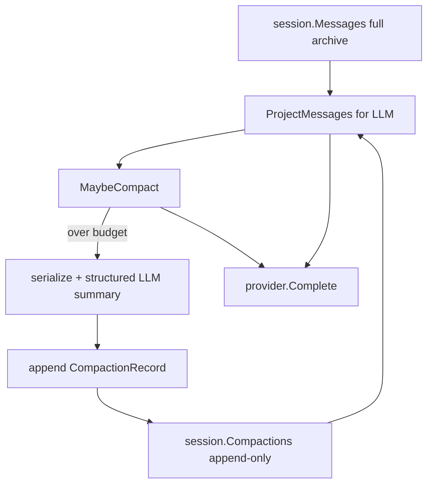

# ADR-0007: Context compaction

**Status:** Accepted  
**Date:** 2026-06-22 (updated 2026-06-23)

## Context

Long multi-turn sessions accumulate message history (user turns, assistant replies, tool results). Without compaction, the context eventually exceeds the model window — causing API errors or degraded quality. ADR-0005 deferred compaction initially; this ADR adds LLM summarization compaction via the plugin architecture.

The design is **pi-aligned**: keep a full message archive on disk, append compaction metadata, and project a smaller view for the LLM.

## Decision

Add **auto LLM summarization compaction** via a core `compaction` contract and a `plugins/compaction/summarize` plugin.

### Architecture



1. **Core contract** — [`compaction/`](../../compaction/): `Compactor`, `Request`, `Result`, `EstimateTokens`, `SplitMessagesByTokens`, `ShouldCompact`, `ProjectMessages`, `SerializeConversation`, `ExtractFileOps`
2. **Summarize plugin** — [`plugins/compaction/summarize/`](../../plugins/compaction/summarize/): when projected context exceeds budget (or on manual `/compact`), summarize older messages via LLM and append a compaction record; keep a recent token tail intact
3. **Agent integration** — `agent` holds `archive` + `compactions`; `messages` is the projected LLM view rebuilt via `appendArchive` / `ProjectMessages`. Call `MaybeCompact` before each `provider.Complete` in `Run()`, after `ResumeSession`, and on manual `CompactSession` / REPL `/compact`
4. **Summarization path** — plugin calls `llm.Provider.Complete` directly (not via `agent.Run`) to avoid recursive compaction

### Archive + projection

- `session.Messages` — full archive, **never shortened** on compact
- `session.Compactions` — append-only `CompactionRecord` entries (`summary`, `first_kept_index`, `tokens_before`, `read_files`, `modified_files`)
- `compaction.ProjectMessages(archive, compactions)` — LLM view: `[compacted summary user msg] + archive[latest.FirstKeptIndex:]`
- **Backward compat:** sessions without `compactions` field load as archive-only (empty compactions)

### Trigger

Compact when `estimate > contextWindow - COMPACTION_RESERVE_TOKENS` OR `force == true` (manual `/compact`).

- **Token estimate:** `sum(len(content) + tool inputs) / 4` — cheap heuristic; real tokenizer deferred
- **Context window:** static model map in `compaction/windows.go`; override via `COMPACTION_CONTEXT_WINDOW`
- **Default reserve:** `16384` tokens for model output

### Split policy

- **Keep recent:** `SplitMessagesByTokens` walks backward until `COMPACTION_KEEP_RECENT_TOKENS` (default `20000`) reached
- **Tool groups:** split never breaks assistant `ToolCalls` from following `tool` result messages (`alignSplitPoint`)
- **Repeated compaction:** summarize from last `FirstKeptIndex` to new cut index; chain previous summary into prompt
- **Force fallback:** when token split yields no prefix but `len(archive) > 1`, keep last message only

### Structured summary

Pi-style serialization for the summarize LLM call:

```
[User]: ...
[Assistant]: ...
[Assistant tool calls]: read_file(...); ...
[Tool result]: ... (truncated at 2000 chars)
```

Summary output uses markdown sections: Goal, Constraints & Preferences, Progress, Key Decisions, Next Steps, Critical Context — plus cumulative file ops from `read_file`, `write_file`, `str_replace`.

### Compacted message format (projected view)

```
[Context compacted — earlier conversation summarized]

<summary>

Continue from the recent messages below.
```

### Config

| Field | Env | Default |
|-------|-----|---------|
| Enabled | `COMPACTION_ENABLED` | `true` |
| Reserve tokens | `COMPACTION_RESERVE_TOKENS` | `16384` |
| Keep recent tokens | `COMPACTION_KEEP_RECENT_TOKENS` | `20000` |
| Context window override | `COMPACTION_CONTEXT_WINDOW` | model lookup or `200000` |
| Disable flag | `--no-compaction` | — |

### REPL

- `/compact` — force compact
- `/compact focus on API changes` — optional `CustomInstructions` forwarded to summarize prompt

## Alternatives Considered

| Approach | Reason not chosen |
|----------|-------------------|
| Truncate/drop old messages only | Loses intent, decisions, and error context |
| In-place message replacement (v1 sketch) | Loses full history; harder to chain compactions |
| Micro-compaction (truncate stale tool outputs) | Valuable but separate concern; deferred |
| Provider-native context APIs | Coupled to provider; not available uniformly |
| API-based context window lookup | Adds network dependency; static map + override sufficient |
| Compaction inside agent without plugin | Violates architecture — LLM summarization is an implementation |
| Compaction via `agent.Run` | Recursive compaction risk; plugin calls provider directly |

## Consequences

**Pros**

- Long sessions stay within context limits proactively
- Full history preserved on disk; LLM sees projected view only
- Manual `/compact` at task boundaries, with optional focus instructions
- Repeated compaction chains summaries iteratively
- Plugin architecture preserved — core defines contract only
- Old session JSON still loads (no `compactions` field)

**Cons / trade-offs**

- Extra LLM call when compaction triggers (cost + latency)
- Char-based token estimate is imprecise — may compact early or late
- No rehydration (re-read recent files after compact) — model relies on summary + recent tail + file ops list
- Summarization quality depends on model; structured prompt mitigates loss
- Split-turn mid-turn cuts deferred (basic tool-group alignment only)

## Deferred

- Micro-compaction (truncate stale large tool outputs)
- Provider usage-based triggering (`CompleteResponse.Usage`)
- Rehydration (re-read recent files after compact)
- Branch summarization (`/tree`)
- Extension hooks (`session_before_compact`)
- Full session entry graph / tree navigation
